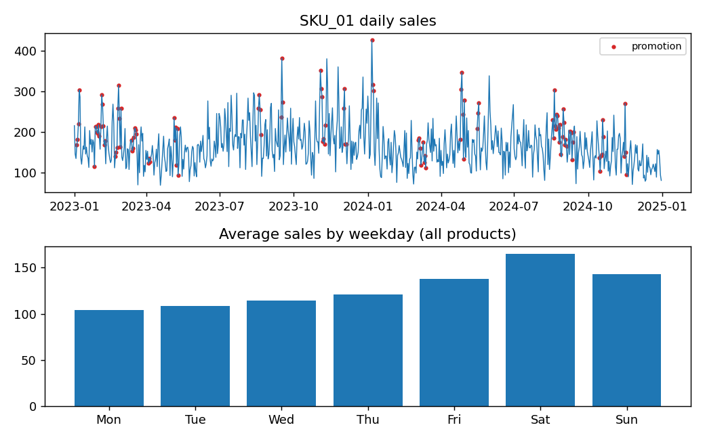
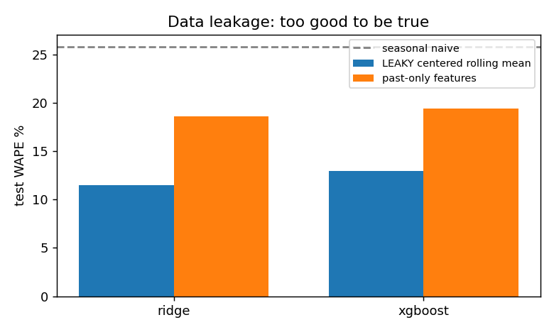
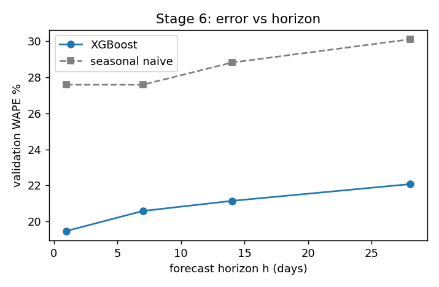
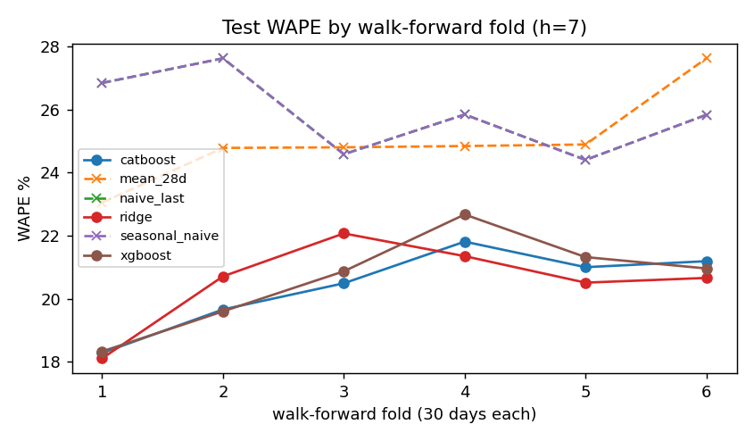

# demandcast — from naive forecast to machine learning

Walk-forward demand forecasting, built as a learning + portfolio project.

> **Question:** can I forecast next week's product demand better than a naive forecast?

The project is deliberately staged. A sophisticated model only matters if it beats a
sensible baseline, so everything is measured against one.

## Quick start

```bash
pip install -e ".[dev]"          # add ".[all]" for CatBoost + PyTorch (LSTM)
python -m demandcast data        # generate synthetic data -> data/demand.csv
python -m demandcast all         # run every stage, write tables + figures to reports/
pytest -q                        # incl. a "rewrite the future" leakage test
```

Individual stages: `baseline`, `leakage`, `windows`, `horizon`, `compare`, `lstm` (`--h N` to change the horizon).

## Data

`demandcast/data.py` simulates 12 products x 2 years of daily sales with weekly and yearly
seasonality, a slow-moving demand level, promotions (price cut + lift), holidays and noisy counts.
Columns: `date, product, sales, price, promotion, holiday`.
To use your own data, drop a CSV with those columns (daily, contiguous per product) at `data/demand.csv`.



## Chronological split — never random

```
TRAIN 2023  |  VALIDATION 2024 H1 (6 x 30-day folds)  |  TEST 2024 H2 (6 x 30-day folds)
```

Every fold trains on all data before its test block (expanding window), see `validation.py`.
Validation folds are used for L / h experiments; the test folds are only used for the final comparison.

## The stages

| Stage | What | Code |
|---|---|---|
| 1 | Naive baselines: last value, same weekday last week, 28-day mean; MAE / MAPE / WAPE / bias | `experiments.run_baseline` |
| 2 | Time series -> supervised learning: window of L days -> `X`, demand at t+h -> `y` | `windows.py` |
| 3 | Features: lags, rolling mean/std (past-only), calendar, promo, price, holiday; **leakage demo** | `features.py` |
| 4 | Correct train / validation / test + walk-forward | `validation.py` |
| 5 | Sweep window length L = 7, 14, 28, 56 | `run_window_sweep` |
| 6 | Sweep horizon h = 1, 7, 14, 28 | `run_horizon_sweep` |
| 7 | Naive -> Ridge -> XGBoost -> CatBoost, plus consistency across folds | `run_compare` |
| V2 | LSTM on the same windows: `(N, L*C)` for trees vs `(N, L, C)` for the LSTM | `lstm.py`, `run_lstm` |

## Results (synthetic data, seed 42)

**Stage 1 — naive baselines, test 2024 H2, h = 1**

| model | MAE | WAPE % | Bias % |
|---|---|---|---|
| last value | 36.02 | 26.35 | -0.00 |
| same weekday last week | 35.22 | 25.77 | -1.34 |
| 28-day mean | 32.73 | 23.95 | -2.08 |

**Stage 3 — data leakage** (test WAPE %, h = 1). A centered 3-day rolling mean peeks at day *d+1* and *d*
itself. It makes the models look far better, and it is not real.

| features | Ridge | XGBoost |
|---|---|---|
| past-only | 18.62 | 19.42 |
| **leaky** centered rolling mean | **11.51** | **12.95** |



**Stage 5 — window length L** (validation, h = 1, XGBoost on flattened windows)

| L | 7 | 14 | 28 | 56 |
|---|---|---|---|---|
| MAE | 22.95 | 22.64 | 22.71 | 22.97 |

More history helps only up to about two weeks here and is flat after that. The simulated data
only has weekly structure plus a slow level, so there is nothing for 28 or 56 days to add.
On real data with monthly or yearly cycles you would expect a different shape.

**Stage 6 — horizon h** (validation WAPE %)

| h | 1 | 7 | 14 | 28 |
|---|---|---|---|---|
| XGBoost | 19.47 | 20.58 | 21.14 | 22.07 |
| seasonal naive | 27.59 | 27.59 | 28.82 | 30.11 |

Error rises with the horizon, which is the "uncertainty grows with h" effect.



**Stage 7 — model comparison, test 2024 H2, h = 7**

| model | MAE | WAPE % | Bias % | vs naive | folds beating naive |
|---|---|---|---|---|---|
| seasonal naive | 35.22 | 25.77 | -1.34 | baseline | baseline |
| 28-day mean | 34.30 | 25.09 | -3.10 | 2.6% | 3/6 |
| Ridge | 28.18 | 20.62 | -1.75 | 20.0% | 6/6 |
| XGBoost | 28.32 | 20.72 | -1.22 | 19.6% | 6/6 |
| CatBoost | 28.01 | 20.50 | -0.91 | 20.5% | 6/6 |



Takeaways: all three ML models beat the naive baseline in every fold, but they are within
about 1 WAPE point of each other, and per fold the ordering changes. On this data the simple
Ridge model is as good as the boosted trees. The synthetic signal is mostly additive, so this
says little about real retail data, but it is a reminder to ask whether a gain is consistent
across folds before declaring a winner.

## Concept -> where it lives

| Theory | In the project |
|---|---|
| Supervised learning | past demand + features -> future demand |
| Window, L | `make_windows(df, L, h)` |
| Horizon h | origin `t = d - h`; lags shorter than h are removed |
| Leakage | features shifted by h; `tests/test_features.py` rewrites the future and checks nothing moves |
| Train / val / test, fold, walk-forward | `validation.py` |
| MAE, WAPE, bias | `metrics.py` |
| Naive baseline | `seasonal_naive`, `naive_last`, `mean_28d` |
| XGBoost / CatBoost / LSTM | `models.py`, `lstm.py` |

## Status and caveats

- Stages 1-7 were run end to end, and the tests pass (`pytest`, 12 tests).
- The **LSTM (V2) code has not been run yet**: PyTorch did not fit in the environment this was
  built in. Install it (`pip install torch`) and run `python -m demandcast lstm`; expect to
  debug small things. If the LSTM does not beat XGBoost, that is still a valid result.
- All numbers above come from simulated data, so treat them as a demonstration of the method,
  not as findings about real demand.
- Hyperparameters are fixed defaults and are not tuned.

## Layout

```
src/demandcast/   data, metrics, features, windows, validation, models, lstm, experiments, cli
tests/            metrics, window alignment, leakage, fold ordering
reports/          CSV tables and PNG figures written by each stage
```

